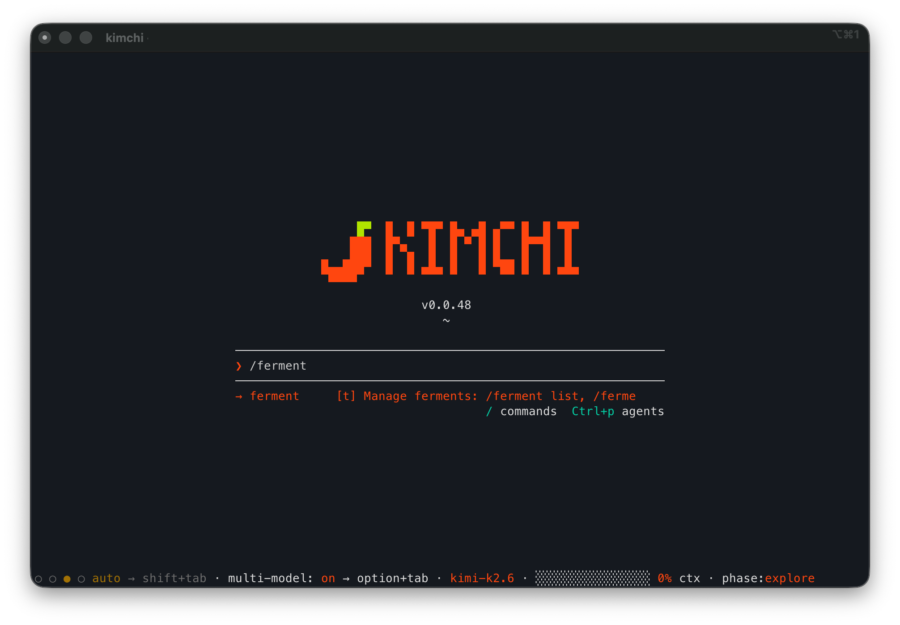

# kimchi

CLI кодинг-агент на базе [kimchi](https://kimchi.dev/). Построенный на базе SDK [pi-mono](https://github.com/badlogic/pi-mono), kimchi предоставляет вам интеллектуального помощника для разработки прямо в терминале, подключенного к инфраструктуре LLM от kimchi.



## Быстрый старт

Установите последнюю версию:

**Homebrew (macOS / Linux):**

```bash
brew install getkimchi/tap/kimchi
```

**Скрипт установки:**

```bash
curl -fsSL https://github.com/getkimchi/kimchi/releases/latest/download/install.sh | bash
```

Затем настройте ваш API-ключ и запустите:

```bash
kimchi setup   # однократная интерактивная настройка
kimchi         # запуск кодинг-агента
```

Выполните `kimchi --help`, чтобы увидеть все доступные подкоманды и флаги.

## Модели

### Выбор модели

Список поддерживаемых моделей загружается при запуске из сервиса метаданных kimchi. Используйте `/model` или `ctrl+p` в интерактивном CLI для переключения между доступными моделями.

Kimchi работает в одном из двух режимов:

| Режим | Индикатор в футере | Поведение |
|-------|-------------------|-----------|
| **Multi-model** | `multi-model (orchestrator-id)` | Оркестратор делегирует каждую подзадачу модели, назначенной на соответствующую роль |
| **Single-model** | название модели | Вся работа выполняется выбранной моделью напрямую |

Используйте `ctrl+p` для циклического переключения моделей. Последний пункт в цикле — `multi-model`. Вы также можете открыть окно выбора `/model` и выбрать конкретную модель или `multi-model` из списка.

В режиме одной модели (single-model) системный промпт оркестрации (окружение, инструменты, правила исследования, рекомендации, теги фаз) остается активным, но классификация задач и делегирование отключены. Инструмент субагента остается доступным, если вы явно попросите агента делегировать задачу.

### Роли моделей

В многомодельном режиме (multi-model) каждый тип задачи обрабатывается определенной ролью. Используйте `/multi-model` в интерактивном CLI, чтобы назначить модели ролям, или отредактируйте файл `~/.config/kimchi/harness/settings.json` напрямую:

```json
{
  "modelRoles": {
    "orchestrator": "kimchi-dev/kimi-k2.6",
    "planner": "kimchi-dev/kimi-k2.6",
    "builder": "kimchi-dev/minimax-m2.7",
    "reviewer": "kimchi-dev/minimax-m2.7",
    "explorer": "kimchi-dev/nemotron-3-super-fp4"
  }
}
```

| Роль | По умолчанию | Описание |
|------|--------------|----------|
| **orchestrator** | `kimchi-dev/kimi-k2.6` | Запускает основной цикл, делегирует работу другим ролям |
| **planner** | `kimchi-dev/kimi-k2.6` | Проектирует подход, пишет спецификации. Если совпадает с оркестратором, планирование выполняется в том же процессе |
| **builder** | `kimchi-dev/minimax-m2.7` | Реализация кода, рефакторинг |
| **reviewer** | `kimchi-dev/minimax-m2.7` | Ревью кода, поиск багов, проверка корректности |
| **explorer** | `kimchi-dev/nemotron-3-super-fp4` | Исследование кодовой базы, чтение файлов, трассировка архитектуры |

Роли принимают любую строку формата `provider/model-id` — модели kimchi-dev или модели от других провайдеров, настроенных в `models.json` (например, `anthropic/claude-sonnet-4-5`, `openai/gpt-4o`). Нужно указывать только значения, отличные от значений по умолчанию; отсутствующие ключи будут использовать значения по умолчанию, указанные выше.

### Отслеживание фаз

Kimchi помечает каждый запрос к LLM меткой `phase:{name}` для аналитики использования и учета затрат. Оркестратор устанавливает фазу по мере продвижения работы, и она отображается в футере.

| Фаза | Описание |
|------|----------|
| `explore` | Навигация по кодовой базе, чтение файлов для понимания структуры |
| `plan` | Проектирование, декомпозиция задач, написание спецификаций |
| `build` | Написание, модификация или рефакторинг кода |
| `review` | Анализ результатов, проверка корректности |
| `research` | Изучение документации, исследование проблем |

Субагенты наследуют текущую фазу от оркестратора, но не могут ее изменить.

## Теги

Kimchi поддерживает тегирование запросов к LLM для отслеживания использования и учета затрат. Теги включаются в каждый запрос и отображаются в футере, сгруппированные по ключам с цветовой кодировкой.

### Команды

| Команда | Описание |
|---------|----------|
| `/tags` | Список всех активных тегов |
| `/tags add key:value ...` | Добавить один или несколько тегов (например, `/tags add project:myapp team:backend`) |
| `/tags remove tag ...` | Удалить один или несколько пользовательских тегов |
| `/tags clear` | Удалить все пользовательские теги |

### Формат тегов

Теги используют формат `key:value`. Ключ и значение должны начинаться и заканчиваться буквенно-цифровыми символами (в середине могут быть `-`, `_`, `.`), максимум 64 символа каждый, всего до 10 тегов.

### Статические теги

Устанавливаются через переменную окружения `KIMCHI_TAGS` (через запятую). Статические теги доступны только для чтения внутри сессии и помечаются маркером `[static]`.

```bash
export KIMCHI_TAGS="team:backend,project:api"
```

### Авто-теги

Два тега добавляются автоматически к каждому запросу и не учитываются в лимите из 10 тегов:

- `model:{model_id}` — модель, обрабатывающая запрос
- `phase:{phase}` — текущая фаза работы

### Сохранение

Пользовательские теги (добавленные через `/tags add`) сохраняются в `~/.config/kimchi/tags.json` и доступны в новых сессиях. Статические теги из `KIMCHI_TAGS` должны устанавливаться каждую сессию.

## Ferment — управление проектами между сессиями

Ferment — это режим проектов Kimchi для поэтапной работы в течение нескольких сессий. Вместо того чтобы начинать каждый чат с нуля, Ferment сохраняет структурированный план (цель, фазы, шаги) в виде файла состояния JSON.

### Быстрый старт

```bash
kimchi --ferment "Собрать Тетрис"
```

Или внутри активной сессии:

```
/ferment new "Собрать Тетрис"    # создать новый проект ferment
/ferment auto                   # продолжать до завершения или блокировки
```

### Концепции

- **Ferment** — проект верхнего уровня (например, "Собрать Тетрис", "Переписать Auth")
- **Phase (Фаза)** — веха внутри проекта (например, "Canvas и сетка", "Движение")
- **Step (Шаг)** — отдельная исполняемая задача внутри фазы (например, "Создать index.html")
- **Decision (Решение)** — архитектурный выбор, записанный для потомков
- **Memory (Память)** — важные замечания, соглашения или паттерны, обнаруженные в ходе работы

### Машина состояний

Все переходы жизненного цикла проверяются детерминированной машиной состояний, которая обеспечивает валидность изменений и предотвращает недопустимые операции (например, завершение шага до его начала).

```
draft -> planned -> running -> [paused] -> complete
```

1. **draft (черновик)** — создан через `/ferment new`, агент собирает цели и фазы в ходе диалога.
2. **planned (спланировано)** — `scope_ferment` устанавливает цель, критерии, ограничения и разбивку по фазам.
3. **running (в процессе)** — `activate_ferment_phase` запускает фазу, агент выполняет шаги.
4. **paused (на паузе)** — требуется вмешательство пользователя или проект приостановлен командой `/ferment pause`.
5. **complete (завершено)** — все фазы закончены.

### Политика продолжения

Управляет тем, переходит ли активный проект ferment через границы фаз автоматически.

| Политика | Поведение | Команда |
|----------|-----------|---------|
| **manual** | Спрашивать перед переходом к следующей фазе | `/ferment manual` |
| **automated** | Продолжать до завершения, блокировки или необходимости ввода от пользователя | `/ferment auto` |

Пауза и возобновление работают отдельно: `/ferment pause` останавливает проект, `/ferment resume` продолжает его с использованием текущей политики. `/ferment exit` выходит из режима Ferment без удаления проекта; работа приостанавливается, интерфейс Ferment очищается, и позже вы сможете выбрать проект через `/ferment list` или `/ferment switch`.

### Команды

| Команда | Описание |
|---------|----------|
| `/ferment` | Запустить новый проект ferment через промпт |
| `/ferment new "Имя"` | Создать новый проект ferment |
| `/ferment switch <id>` | Переключиться на проект по префиксу ID или имени |
| `/ferment delete <id>` | Удалить навсегда |
| `/ferment export` | Экспортировать статистику в JSON |
| `/ferment progress` | Открыть оверлей навигации по фазам/шагам |
| `/ferment manual` | Установить ручную политику продолжения |
| `/ferment auto` | Установить автоматическую политику продолжения |
| `/ferment pause` | Приостановить жизненный цикл активного проекта |
| `/ferment resume` | Возобновить жизненный цикл активного проекта |
| `/ferment exit` | Выйти из режима Ferment без удаления проекта |

### Восстановление

Каждая сессия записывает запись `ferment_reference` в лог сессии. При следующем запуске оболочка считывает эту запись и возобновляет работу из точного состояния.

```bash
# День 1
$ kimchi --ferment "Собрать Тетрис"
# ... агент работает, происходит сбой или терминал закрывается ...

# День 2
$ kimchi --ferment "Собрать Тетрис"
# -> Восстанавливает состояние и продолжает Фазу 2 ровно с того места, где остановился
```

### Где хранятся данные

```
.kimchi/
  ferments/
    <uuid>.json          -- снепшот (состояние плана, читаемое машиной)
    <uuid>.events.jsonl  -- лог событий всех переходов (только для добавления)
  sessions/
    <timestamp>.jsonl    -- история чата + вызовы инструментов
```

Каждое изменение сохраняется как событие в логе с хешами состояния «до» и «после», что обеспечивает полную аудируемость. Статистика вычисляется по запросу из снепшота и экспортируется через `/ferment export`.

Полную документацию см. в `docs/ferment.md` и `docs/ferment-storage-schema.md`.

## Удаленный доступ Teleport (предварительная версия)

Запустите с флагом `kimchi --teleport`, чтобы включить команды мультиплексирования сессий. Локальный TUI остается основной базой; удаленные воркеры создаются, отключаются и подключаются заново без перезапуска kimchi.

```bash
kimchi --teleport
```

Слэш-команды, доступные внутри TUI:

| Команда | Описание |
|---------|----------|
| `/teleport [имя] [флаги]` | Синхронизировать рабочее дерево с новой удаленной песочницей и переключиться на нее. Флаги: `--allow-dirty`, `--exclude <glob>`, `--include-ignored`, `--abandon-pending`, `--force` |
| `/detach [--abandon-pending]` | Разорвать WebSocket-соединение с удаленной машиной и вернуться в локальную базу. Сервер продолжит выполнение сессии. |
| `/detach [--abandon-pending]` | Разорвать WebSocket-соединение с удаленной машиной и вернуться в локальную базу. Сервер продолжит выполнение сессии. |
| `/attach <имя-или-id>` | Подключиться заново к ранее отключенной удаленной машине |
| `/sessions` | Список всего: активная удаленная машина, отключенные машины, серверные сессии |
| `/connect [имя-или-id]` | Открыть интерактивную SSH-оболочку в песочнице через прокси teleport |

`--teleport` и `--remote` являются взаимоисключающими. Используйте `--remote --session <id>` для подключения к одной удаленной машине при запуске; используйте `--teleport` для мультиплексирования из локальной базы.

## Конфигурация

### Аутентификация

API-ключ определяется в следующем порядке:

1. Переменная окружения `KIMCHI_API_KEY` (имеет приоритет)
2. Файл `~/.config/kimchi/config.json`, поле `api_key`

Запустите `kimchi setup` для интерактивной первоначальной настройки.

### Конфигурация агента

Kimchi хранит свои настройки, сессии и модели в директории:

```
~/.config/kimchi/harness/
```

### Пакеты

Kimchi поддерживает нативные пакеты Pi. Команда `kimchi install npm:<package>` устанавливает пакет только для Kimchi, в то время как `pi install npm:<package>` оставляет пакет в ведении оригинальной оболочки Pi. Kimchi также может загружать оригинальные пакеты Pi через ресурс **Pi package lookup**, так что обе CLI могут использовать пакеты Pi, не разделяя область установки Kimchi.

Если один и тот же пакет установлен в обоих местах, приоритет имеет версия Kimchi. Отключить поиск оригинальных пакетов Pi можно командой:

```bash
kimchi resources disable extensions.pi-package-lookup
```

Обновление пакетов:

```bash
kimchi update                  # обновить установленные пакеты, а затем сам Kimchi
kimchi update --extensions     # обновить только установленные пакеты
kimchi update context-mode     # обновить один пакет по источнику или отображаемому имени
kimchi update self             # обновить только сам Kimchi
```

### HTTP-прокси

Kimchi учитывает переменные окружения `HTTP_PROXY` / `HTTPS_PROXY` для сетевых запросов.

### Оптимизация токенов (RTK)

Kimchi устанавливает [RTK](https://github.com/rtk-ai/rtk) во время настройки и поддерживает доступность команды `rtk` при запуске. При включении этой функции kimchi переписывает вызовы инструментов bash через `rtk rewrite` перед выполнением. Это сжимает вывод команд (git, cargo, npm, docker и т. д.) на 60–90%, снижая использование контекста LLM.

Перед каждым выполнением инструмента bash kimchi вызывает `rtk rewrite "<command>"`. Если RTK возвращает переписанную команду (например, `git status` превращается в `rtk git status`), выполняется именно переписанная версия.

```bash
brew install rtk    # macOS / Linux
```

Управление RTK rewrite осуществляется через ресурсы:

```bash
kimchi resources disable hooks.rtk-rewrite
kimchi resources enable hooks.rtk-rewrite
```

### Хуки (Hooks)

Пользователи могут добавлять кастомные Bash-хуки для переписывания или блокировки команд оболочки перед их выполнением. Глобальные хуки находятся в `~/.config/kimchi/harness/hooks/bash/`; хуки проекта — в `.kimchi/hooks/bash/` (по умолчанию отключены, пока не будут включены через `/resources` или `kimchi resources enable ...`).

См. `docs/hooks.md` для описания протокола хуков и примеров.

### Миграция с других кодинг-агентов

При первом запуске kimchi ищет установленные **Claude Code** или **OpenCode** и предлагает мигрировать их MCP-серверы. Если миграция возможна, вы увидите запрос:

```
+  Найдена конфигурация Claude Code / OpenCode
|
|  MCP-серверы: filesystem, github, ripgrep
|  Навыки Claude Code: 4 в ~/.claude/skills
|  Навыки OpenCode: 2 в ~/.config/opencode/skills
|
*  Мигрировать MCP-серверы в Kimchi?
|  * Мигрировать сейчас
|  * Пропустить в этот раз
|  * Больше не спрашивать
```

Обнаруженные MCP-серверы объединяются в `~/.config/kimchi/harness/mcp.json`. При конфликтах имен записи Kimchi всегда имеют приоритет, поэтому повторный запуск миграции безопасен.

Запрос отображается только в том случае, если есть что мигрировать. Если ни один агент не установлен или их конфигурации пусты, мастер настройки пропустит этот шаг без уведомления.

#### Сканируемые источники

| Агент | Конфиг-файлы (читаются по порядку, результаты объединяются) | Директория навыков |
|---|---|---|
| Claude Code | `~/.claude.json` (верхний уровень `mcpServers` + проекты `projects[*].mcpServers`) | `~/.claude/skills/` |
| OpenCode | `$OPENCODE_CONFIG`, затем `~/.config/opencode/opencode.json`, `opencode.jsonc`, `config.json`, `~/.opencode.json` | `~/.config/opencode/skills/` |

Для OpenCode поддерживаются как современные (блок `mcp`), так и устаревшие (блок `mcpServers`) схемы. Серверы с `enabled: false` игнорируются.

#### Разрешение конфликтов

Если одно и то же имя MCP-сервера встречается в нескольких источниках:

1. **Внутри одного агента**: более ранние файлы имеют приоритет; проектные настройки выше глобальных (Claude Code); блок `mcp` выше `mcpServers` (OpenCode).
2. **Между агентами**: Claude Code имеет приоритет над OpenCode.
3. **Против существующей конфигурации Kimchi**: ваши записи в `~/.config/kimchi/harness/mcp.json` всегда имеют наивысший приоритет.

#### "Больше не спрашивать"

Хранится в `~/.config/kimchi/config.json` (`migrationState: "skip-forever"`). Удалите это поле, чтобы снова вызвать запрос.

## Разработка

### Требования

- Node.js 22 (LTS)
- [Bun](https://bun.sh/) (для сервера разработки и компиляции бинарных файлов)
- [corepack](https://nodejs.org/api/corepack.html) включен (`corepack enable`)
- pnpm (устанавливается автоматически через corepack)

### Быстрая настройка

```bash
./scripts/dev-startup.sh
```

Этот скрипт проверяет и устанавливает node, pnpm и bun, если они отсутствуют, запускает `pnpm install`, копирует ресурсы и запускает оболочку через `pnpm run dev`.

### Ручная настройка

```bash
git clone git@github.com:getkimchi/kimchi.git
cd kimchi
corepack enable
pnpm install
```

### Команды

| Команда | Описание |
|---------|----------|
| `pnpm run build` | Скомпилировать TypeScript в `dist/` и скопировать ассеты тем |
| `pnpm run dev` | Запустить CLI локально через Bun |
| `pnpm run check` | Линтинг Biome + проверка типов TypeScript |
| `pnpm run lint` | Только линтинг Biome |
| `pnpm run lint:fix` | Линтинг Biome с авто-исправлением |
| `pnpm run test` | Запустить тесты через vitest |
| `pnpm run test:smoke` | Сквозные (e2e) дымовые тесты |

### Локальный запуск

Перед первым запуском скопируйте ресурсы:

```bash
node ./scripts/copy-resources.js --dev
```

Запустите CLI напрямую через Bun:

```bash
pnpm run dev
```

Или соберите автономный бинарный файл:

```bash
pnpm run build:binary
./dist/bin/kimchi
```

### Структура проекта

```
src/
  entry.ts              -- Точка входа
  cli.ts                -- Логика CLI и инициализация оболочки
  cli-args.ts           -- Парсинг аргументов
  config.ts             -- Загрузка авторизации и конфига
  models.ts             -- Загрузка метаданных моделей и их регистрация
  setup-wizard.ts       -- Мастер первой настройки
  commands/             -- Подкоманды CLI (setup, login, config, update, ...)
  extensions/           -- Расширения агента
    agents/             -- Система субагентов (персоны, менеджер, память)
    orchestration/      -- Классификация задач, реестр моделей, делегирование
    ferment/            -- Инструменты и UI жизненного цикла Ferment
    mcp-adapter/        -- Интеграция MCP-серверов
    permissions/        -- Потоки авторизации инструментов
    behaviours/         -- Контекстные поведения промптов
    web-fetch/          -- Загрузка веб-контента
    web-search/         -- Веб-поиск
    lsp/                -- Language Server Protocol
    login/              -- Потоки OAuth
    onboarding/         -- Мастер запуска режима сессий
  ferment/              -- Машина состояний Ferment, хранилище событий, статистика
  modes/
    interactive/        -- Интерактивная оболочка TUI
    acp/                -- JSON-RPC через stdio (интеграция с IDE)
    teleport/           -- Мультиплексирование удаленных сессий
  agent-discovery/      -- Обнаружение и миграция других кодинг-агентов
  config/               -- Загрузка и объединение конфигураций
  auth/                 -- Управление API-ключами
  utils/                -- Общие вспомогательные функции
```

## Бенчмаркинг

Директория `benchmark/` содержит инструменты для тестирования сессий kimchi и аудита их качества.

- **Manual benchmarks** (`benchmark/manual/`) — запуск предопределенных задач на разных моделях и сравнение результатов. См. `benchmark/manual/README.md`.
- **Terminal-bench-2** (`benchmark/terminal-bench-2/`) — запуск набора [terminal-bench](https://www.harborframework.com/) (89 задач) в Docker-контейнерах. См. `benchmark/terminal-bench-2/README.md`.
- **Session audit** (`benchmark/audit-session/`) — аудит завершенной сессии на предмет соблюдения фаз, качества кода, архитектуры, тестирования и эффективности затрат. См. `benchmark/audit-session/README.md`.

## Релизы

Автономные бинарные файлы собираются автоматически через GitHub Actions при пуше тега версии (`v*`). Бинарные файлы компилируются с помощью `bun build --compile` и не требуют рантайма на машине пользователя.

Поддерживаемые платформы:

- macOS (amd64, arm64)
- Linux (amd64, arm64)

Ассеты релиза именуются по шаблону `kimchi_{os}_{arch}.tar.gz` и включают файл `checksums.txt` (SHA256) для проверки.

## Лицензия

[Apache License 2.0](LICENSE) — см. [CONTRIBUTING.md](CONTRIBUTING.md) для информации о CLA и правилах для контрибьюторов.
